# INK·LINK — Documentación Técnica v1

> 📌 **Nota de vigencia (2026-07-17)**: este documento corresponde a la **visión de producto de la Entrega 1**. Decisiones posteriores (`fixs/issue-002.md`, `issue-003.md`, `issue-004.md`, `issue-007.md`) acotaron el MVP a un **flujo 100 % cliente**: el artista es datos seed (sin panel de gestión ni login operativo), no hay registro de usuarios, notificaciones ni foto de curación a 90 días. El **backlog vigente es [docs/us/all-us.md](us/all-us.md)** (13 US · 80 SP, todas implementadas) y el contrato oficial de la API es [docs/api-spec.yml](api-spec.yml). Los casos de uso afectados llevan su propia nota 📌.

---

## 1. Descripción del Software

### 1.1 Descripción General

**INK·LINK** es un sitio web responsive que funciona como vitrina digital y marketplace transaccional para la industria del tatuaje en Chile. La plataforma reemplaza el proceso informal y fragmentado de buscar tatuadores en redes sociales (Instagram, TikTok, WhatsApp) con un flujo digital estructurado que cubre todo el ciclo: desde el descubrimiento del artista hasta la calificación post-curación.

El sistema conecta tres actores principales: clientes que buscan tatuarse (18+ años), tatuadores y estudios que necesitan visibilidad profesional, y marcas del rubro que buscan canales de publicidad dirigidos. INK·LINK opera inicialmente en Santiago, Chile, con un stack Angular + .NET + PostgreSQL.

El principio fundamental del MVP es la **autonomía del flujo**: el artista configura su perfil, tarifas y agenda una sola vez, y a partir de ahí todo el ciclo del cliente ocurre sin intervención del artista en tiempo real.

### 1.2 Valor Añadido

- **Transparencia de precios**: chatbot cotizador entrega un rango de precio inmediato basado en tarifas publicadas del artista — sin esperar días por un DM
- **Reserva directa sin fricción**: el cliente elige slot y paga depósito sin aprobación del artista
- **Reseñas verificadas en 4 dimensiones**: higiene, manejo del dolor, trato al cliente y resultado — solo clientes con booking completado pueden reseñar
- **Foto de curación a 90 días**: diferenciador único que evalúa el resultado real del tatuaje después de sanar
- **Certificación sanitaria visible**: insignia verificable que genera confianza instantánea
- **Protección económica**: depósito con política anti no-show protege a ambas partes
- **Ahorro de tiempo para artistas**: elimina 2+ horas/día respondiendo preguntas repetitivas por DM

### 1.3 Ventajas Competitivas

| vs. Redes Sociales | vs. Directorios Genéricos |
|---|---|
| Filtros reales por estilo, precio, rating | Especializado 100% en tatuaje |
| Cotización instantánea sin espera | Sistema de reseñas con 4 dimensiones + foto curación |
| Pago protegido con depósito | Reserva directa integrada con pasarela local (Flow) |
| Perfil permanente (no stories que desaparecen) | Certificación sanitaria y premios verificados |

### 1.4 Funciones Principales

1. **Descubrir** — Vitrina visual + mapa interactivo con geolocalización y filtros avanzados
2. **Comparar** — Perfiles profesionales con portafolio, certificaciones, premios y auspicios
3. **Cotizar** — Chatbot conversacional que estima precio según tarifas del artista
4. **Reservar** — Selección de slot + pago de depósito vía Flow sin aprobación del artista
5. **Calificar** — Reseñas en 4 ejes + foto de curación a 90 días

### 1.5 Lean Canvas

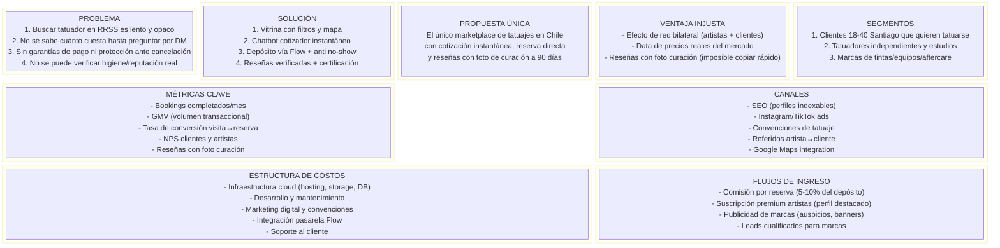

---

## 2. Casos de Uso (Must-Have y Should-Have)

### 2.1 CU-01: Cliente Cotiza y Reserva un Tatuaje

> 📌 **Vigencia**: implementado en US0008 + US0009 + US0011 con dos matices respecto de esta visión: **no existe registro** de usuarios (cuentas seed; el paso 9 es solo login — US0001) y la confirmación **no envía email/notificación** (Won't-Have) — se muestra en pantalla y en "Mis reservas". Además, si la reserva nace de una cotización, el depósito se calcula sobre el mínimo cotizado (`fixs/issue-007.md`).

**Actores:** Cliente, Sistema (Chatbot Cotizador), Pasarela Flow

**Precondiciones:**
- El artista tiene perfil activo con tarifas publicadas y agenda con slots disponibles
- El cliente tiene conexión a internet (no requiere cuenta para descubrir/cotizar)

**Postcondiciones:**
- Se crea un booking confirmado con depósito pagado
- Ambas partes reciben confirmación (email + notificación)
- El slot queda bloqueado en la agenda del artista

**Flujo Principal:**
1. El cliente abre INK·LINK y navega la vitrina/mapa
2. Aplica filtros (estilo, zona, precio, rating)
3. Selecciona un artista y revisa su perfil
4. Inicia cotización con el chatbot
5. Responde las 5 preguntas (zona corporal, tamaño, estilo, referencias, color/cover-up)
6. El chatbot calcula y muestra rango de precio estimado
7. El cliente acepta el rango y ve slots disponibles
8. Selecciona un slot y ve resumen (artista, fecha, hora, precio, depósito)
9. Se registra/inicia sesión (si no lo estaba)
10. Paga depósito vía Flow
11. Recibe confirmación de reserva

**Flujos Alternativos:**
- 6a. El precio no convence → el cliente vuelve a la vitrina
- 7a. No hay slots esta semana → el cliente ve próximas semanas disponibles
- 10a. Pago rechazado → se muestra error y opción de reintentar

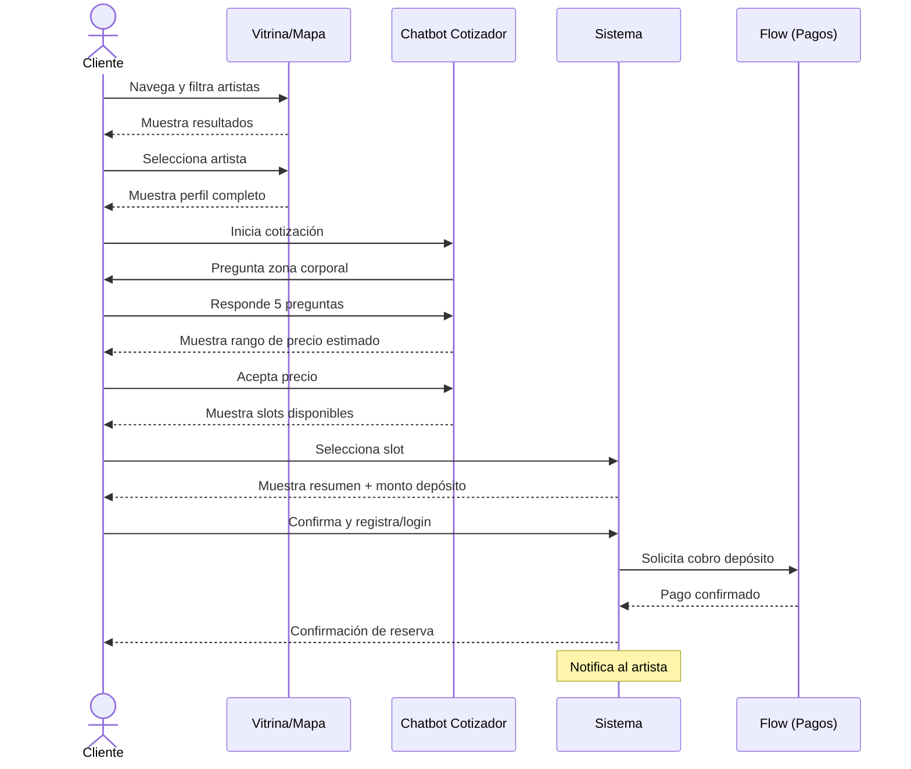

### 2.2 CU-02: Tatuador Configura su Perfil y Agenda

> ⚠️ **Fuera del MVP** (decisión `fixs/issue-003.md`, flujo 100 % cliente): el artista es **datos pre-cargados vía seed** — perfil, tarifas, portafolio y agenda se cargan en `backend/Seed/DatabaseSeeder.cs`. No existe panel de gestión ni login operativo de artista. Este caso de uso queda documentado como referencia para versiones futuras.

**Actores:** Tatuador/Estudio

**Precondiciones:**
- El tatuador tiene cuenta creada y verificada (email)

**Postcondiciones:**
- Perfil público visible en vitrina y mapa
- Agenda con slots disponibles para reserva directa
- Tarifas publicadas que alimentan al chatbot cotizador

**Flujo Principal:**
1. El tatuador inicia sesión
2. Accede a su panel de gestión
3. Completa información del perfil (bio, estilos, experiencia, ubicación)
4. Sube fotos de portafolio (hasta 100 fotos HD)
5. Configura tarifas (precio mínimo por sesión, precio por hora)
6. Define política de depósito (% y política de cancelación)
7. Configura agenda semanal (horarios disponibles, duración de slots)
8. Publica el perfil
9. El perfil aparece en vitrina y mapa

**Flujos Alternativos:**
- 3a. Perfil incompleto → se guarda como borrador, no se publica
- 7a. Bloquea fechas específicas (vacaciones, convenciones)

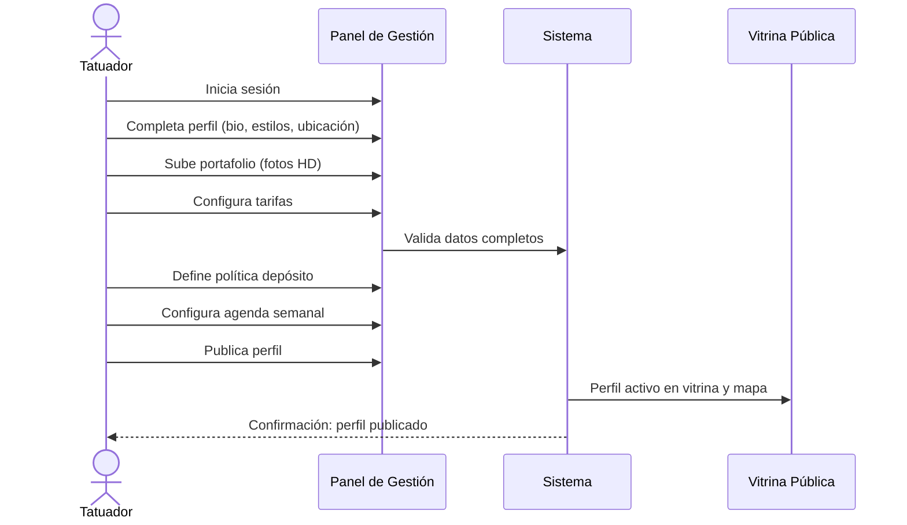

### 2.3 CU-03: Cliente Califica con Foto de Curación

> 📌 **Vigencia**: implementado parcialmente como **US0013** (calificación en 4 dimensiones tras confirmar asistencia). La **foto de curación a los 90 días** y la **respuesta del artista a reseñas** quedaron **Won't-Have** (decisión `fixs/issue-003.md`). La foto adjunta a la reseña tiene además una limitación conocida de persistencia (`fixs/issue-005.md`).

**Actores:** Cliente

**Precondiciones:**
- El cliente tiene un booking completado (sesión realizada)

**Postcondiciones:**
- Reseña publicada con calificación en 4 dimensiones
- Foto de curación asociada a la reseña (si han pasado 90+ días)
- Rating del artista actualizado
- Reseña marcada con badge "✅ Reseña Completa" si incluye foto de curación

**Flujo Principal:**
1. El cliente accede a su historial de bookings completados
2. Selecciona un booking y abre el formulario de reseña
3. Califica en 4 dimensiones (1-5 estrellas): Higiene, Manejo del dolor, Trato, Resultado
4. Escribe texto opcional de reseña
5. Si han pasado 90+ días, puede subir foto de curación
6. Confirma y publica
7. La reseña aparece en el perfil del artista

**Flujos Alternativos:**
- 5a. No han pasado 90 días → la reseña se publica sin foto de curación, el cliente puede volver después a agregar la foto
- 6a. El artista responde la reseña públicamente

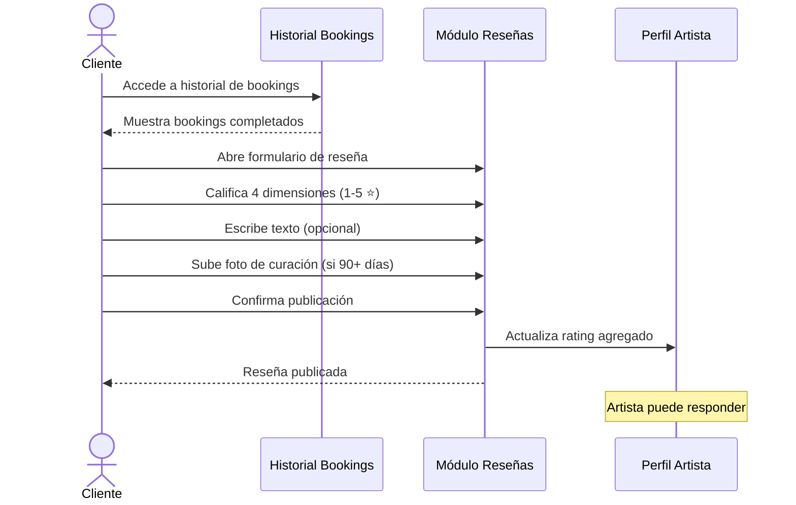

### 2.4 CU-04: Cliente Descubre Artistas en la Vitrina con Filtros (Must-Have)

**Actores:** Cliente (sin login obligatorio)

**Precondiciones:**
- Existen artistas con perfil publicado en la plataforma

**Postcondiciones:**
- El cliente visualiza una lista filtrada de artistas/tatuajes que coinciden con sus criterios
- Puede acceder al perfil de cualquier artista desde los resultados

**Flujo Principal:**
1. El cliente abre INK·LINK (sin login)
2. Ve la vitrina con secciones: "Cerca de ti", "Mejor calificados", "Estilos populares", "Artistas premiados"
3. Aplica filtros: estilo, rango de precio, calificación mínima, certificación sanitaria, disponibilidad, tipo (estudio/independiente)
4. Opcionalmente busca por texto (nombre artista, estilo, comuna)
5. Ve resultados actualizados en tiempo real
6. Selecciona un artista para ver su perfil completo

**Flujos Alternativos:**
- 3a. No hay resultados con los filtros aplicados → sugiere ampliar criterios
- 2a. El navegador no permite geolocalización → muestra resultados de toda la ciudad

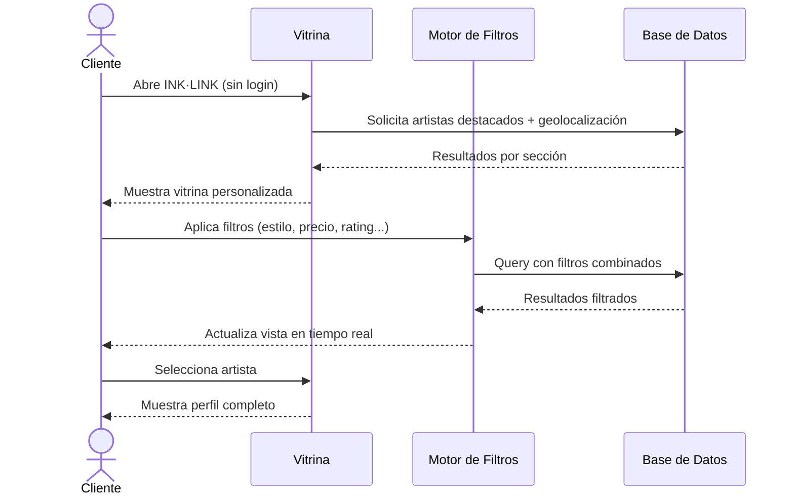

### 2.5 CU-05: Cliente Explora Artistas en Mapa Interactivo (Should-Have)

**Actores:** Cliente

**Precondiciones:**
- El navegador permite geolocalización (o el cliente selecciona ubicación manual)
- Existen artistas con coordenadas registradas

**Postcondiciones:**
- El cliente visualiza artistas geolocalizados y puede acceder a sus perfiles

**Flujo Principal:**
1. El cliente accede a la vista de mapa
2. El sistema solicita permiso de geolocalización
3. El mapa se centra en la ubicación del cliente
4. Se muestran marcadores de artistas/estudios con clustering automático
5. El cliente ajusta radio de búsqueda (1km, 5km, 10km, toda la ciudad)
6. Toca un marcador y ve preview card (foto portafolio, nombre, rating, estilo)
7. Desde el preview, accede a "Ver perfil" o "Cotizar"

**Flujos Alternativos:**
- 2a. El cliente rechaza geolocalización → muestra mapa centrado en Santiago con selector de comuna
- 5a. Cambia a vista lista como alternativa al mapa

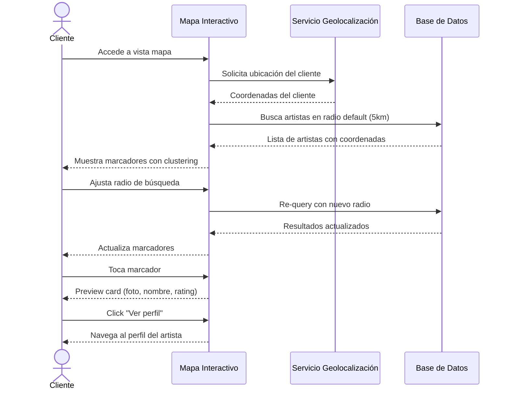

### 2.6 CU-06: Cliente Cotiza un Tatuaje con Chatbot (Should-Have)

**Actores:** Cliente, Sistema (Chatbot Cotizador)

**Precondiciones:**
- El artista tiene tarifas publicadas (precio mínimo + precio por hora)
- El cliente está en el perfil de un artista o accede desde la vitrina

**Postcondiciones:**
- El cliente obtiene un rango de precio estimado para su tatuaje
- Los requisitos quedan registrados para la eventual reserva

**Flujo Principal:**
1. El cliente inicia conversación con el chatbot desde el perfil del artista
2. Chatbot pregunta: "¿En qué zona del cuerpo?" → cliente selecciona en silueta interactiva
3. Chatbot pregunta: "¿Qué tamaño aproximado?" → cliente elige referencia visual (moneda→palma→mano→brazo)
4. Chatbot pregunta: "¿Qué estilo te interesa?" → cliente selecciona de galería
5. Chatbot pregunta: "¿Tienes imágenes de referencia?" → cliente sube 1-3 fotos (opcional)
6. Chatbot pregunta: "¿Color o B&N? ¿Es cover-up?" → cliente responde
7. El chatbot calcula rango de precio usando tarifas del artista + factores de complejidad
8. Muestra estimación: "Precio estimado: $80.000 – $150.000 CLP"
9. Ofrece CTA: "¿Quieres reservar?" → flujo directo a selección de slot

**Flujos Alternativos:**
- 5a. El cliente no tiene imágenes → el chatbot continúa sin referencias
- 8a. El cliente quiere ajustar parámetros → vuelve a paso relevante
- 9a. El cliente no quiere reservar ahora → se guarda la cotización para después

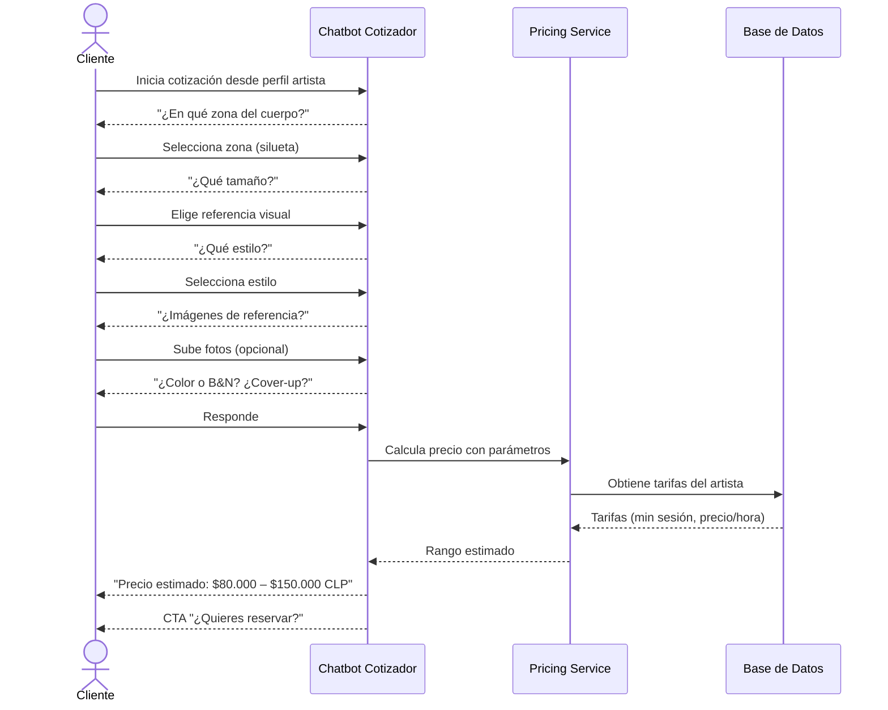

### 2.7 CU-07: Sistema Gestiona Cancelación y Protección Anti No-Show (Won't-Have)

> ⚠️ **Won't-Have MVP** — Este caso de uso queda documentado como referencia para versiones futuras. No se implementa en la primera entrega.

**Actores:** Cliente, Tatuador, Sistema

**Precondiciones:**
- Existe un booking confirmado con depósito pagado
- La política de cancelación del artista está definida (24h, 48h o 72h)

**Postcondiciones:**
- Depósito redistribuido según política: al artista (no-show cliente) o reembolsado (cancelación artista)
- Booking marcado con estado correspondiente
- Ambas partes notificadas

**Flujo Principal (Cliente no se presenta):**
1. Llega la fecha/hora del booking
2. El artista marca al cliente como "no presentado" en su panel
3. El sistema aplica política anti no-show
4. El depósito se transfiere al artista como compensación
5. El booking se marca como "no_show"
6. Ambas partes reciben notificación del resultado

**Flujo Alternativo A (Cliente cancela dentro de plazo):**
1. El cliente solicita cancelar el booking
2. El sistema verifica si está dentro del plazo de cancelación gratuita
3. Está dentro del plazo → reembolso completo del depósito
4. Slot se libera en la agenda del artista

**Flujo Alternativo B (Cliente cancela fuera de plazo):**
1. El cliente solicita cancelar
2. Está fuera del plazo → depósito no reembolsable (va al artista)
3. Booking marcado como "cancelled_client"

**Flujo Alternativo C (Artista cancela):**
1. El artista cancela el booking desde su panel
2. Reembolso completo al cliente (sin importar plazo)
3. Booking marcado como "cancelled_artist"

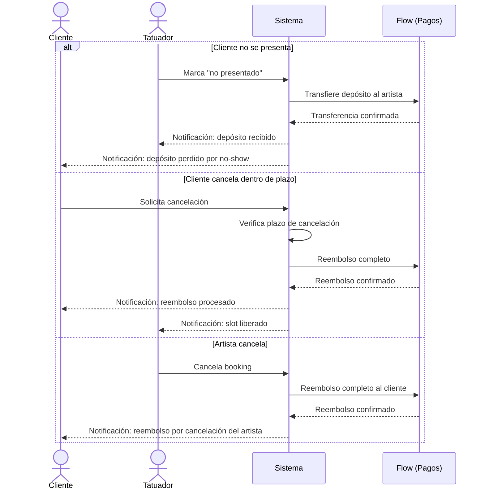

### 2.8 CU-08: Cliente Compara Artistas por Certificaciones y Premios (Must-Have)

**Actores:** Cliente

**Precondiciones:**
- Existen artistas con datos seed de certificaciones, premios y/o auspicios

**Postcondiciones:**
- El cliente puede tomar una decisión informada basada en credenciales verificadas

**Flujo Principal:**
1. El cliente navega la vitrina o resultados de búsqueda
2. Ve badges de certificación sanitaria (✅) y premios (🏆) en cada tarjeta de artista
3. Filtra exclusivamente por artistas con certificación sanitaria vigente
4. Filtra por artistas con reconocimientos/premios
5. Accede al perfil de un artista
6. Ve sección de reconocimientos (evento, categoría, año) con badges verificados
7. Ve certificación sanitaria (tipo, emisor, vigencia)
8. Ve auspicios de marcas ("Auspiciado por [Marca]" con logo)
9. Compara con otro artista abriendo perfil en nueva pestaña

**Flujos Alternativos:**
- 3a. No hay artistas certificados en su zona → se amplia radio automáticamente
- 6a. El artista no tiene premios → sección no se muestra

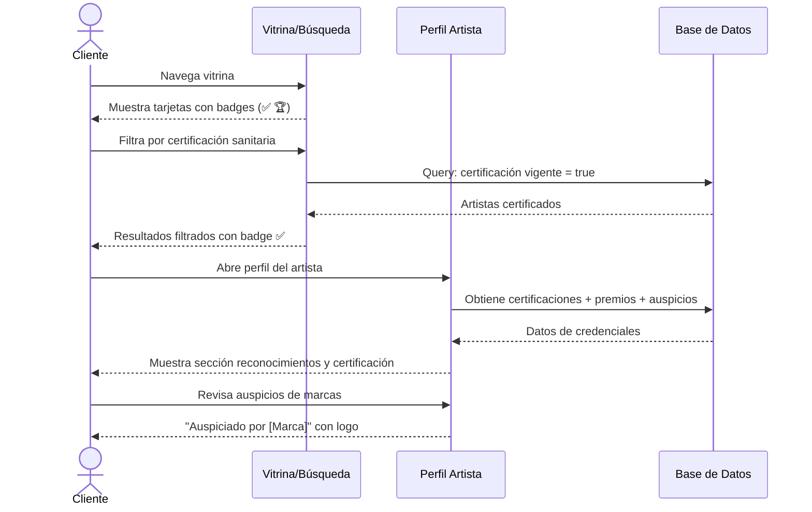

---

## 3. Modelo de Datos

### 3.1 Entidades y Atributos

#### User (base para todos los usuarios)

| Atributo | Tipo | Descripción |
|---|---|---|
| id | UUID | Identificador único |
| email | VARCHAR(255) | Email único |
| password_hash | VARCHAR(255) | Hash de contraseña |
| role | ENUM | 'client', 'artist', 'admin' |
| first_name | VARCHAR(100) | Nombre |
| last_name | VARCHAR(100) | Apellido |
| phone | VARCHAR(20) | Teléfono |
| avatar_url | VARCHAR(500) | URL de avatar |
| is_verified | BOOLEAN | Email verificado |
| created_at | TIMESTAMP | Fecha de creación |
| updated_at | TIMESTAMP | Última actualización |

#### ArtistProfile

| Atributo | Tipo | Descripción |
|---|---|---|
| id | UUID | Identificador único |
| user_id | UUID (FK) | Referencia a User |
| slug | VARCHAR(100) | URL amigable (inklink.cl/artista/slug) |
| bio | TEXT | Descripción profesional |
| years_experience | INT | Años de experiencia |
| artist_type | ENUM | 'independent', 'studio' |
| latitude | DECIMAL(10,8) | Coordenada lat |
| longitude | DECIMAL(11,8) | Coordenada lng |
| address | VARCHAR(300) | Dirección física |
| commune | VARCHAR(100) | Comuna |
| min_session_price | INT | Precio mínimo por sesión (CLP) |
| hourly_rate | INT | Precio por hora (CLP) |
| deposit_percentage | INT | % de depósito (default 30) |
| cancellation_policy | ENUM | '24h', '48h', '72h' |
| is_published | BOOLEAN | Perfil publicado/borrador |
| rating_avg | DECIMAL(3,2) | Rating promedio calculado |
| total_reviews | INT | Cantidad total de reseñas |

#### PortfolioItem

| Atributo | Tipo | Descripción |
|---|---|---|
| id | UUID | Identificador único |
| artist_profile_id | UUID (FK) | Referencia a ArtistProfile |
| image_url | VARCHAR(500) | URL de la imagen |
| thumbnail_url | VARCHAR(500) | URL del thumbnail |
| style_id | UUID (FK) | Estilo del tatuaje |
| description | VARCHAR(500) | Descripción opcional |
| is_featured | BOOLEAN | Foto destacada |
| sort_order | INT | Orden en portafolio |
| created_at | TIMESTAMP | Fecha de subida |

#### TattooStyle

| Atributo | Tipo | Descripción |
|---|---|---|
| id | UUID | Identificador único |
| name | VARCHAR(50) | Nombre del estilo |
| slug | VARCHAR(50) | Slug para filtros |
| icon_url | VARCHAR(500) | Icono representativo |

#### ArtistStyle (tabla pivote)

| Atributo | Tipo | Descripción |
|---|---|---|
| artist_profile_id | UUID (FK) | Referencia a ArtistProfile |
| style_id | UUID (FK) | Referencia a TattooStyle |

#### Availability

| Atributo | Tipo | Descripción |
|---|---|---|
| id | UUID | Identificador único |
| artist_profile_id | UUID (FK) | Referencia a ArtistProfile |
| day_of_week | INT | Día (0=Lunes, 6=Domingo) |
| start_time | TIME | Hora inicio |
| end_time | TIME | Hora fin |
| slot_duration_minutes | INT | Duración de cada slot |
| is_active | BOOLEAN | Activo/inactivo |

#### BlockedDate

| Atributo | Tipo | Descripción |
|---|---|---|
| id | UUID | Identificador único |
| artist_profile_id | UUID (FK) | Referencia a ArtistProfile |
| blocked_date | DATE | Fecha bloqueada |
| reason | VARCHAR(200) | Motivo opcional |

#### Booking

| Atributo | Tipo | Descripción |
|---|---|---|
| id | UUID | Identificador único |
| client_id | UUID (FK) | Referencia a User (cliente) |
| artist_profile_id | UUID (FK) | Referencia a ArtistProfile |
| booking_date | DATE | Fecha de la cita |
| start_time | TIME | Hora inicio |
| end_time | TIME | Hora fin |
| status | ENUM | 'confirmed', 'completed', 'cancelled_client', 'cancelled_artist', 'no_show' |
| estimated_price_min | INT | Precio estimado mínimo (CLP) |
| estimated_price_max | INT | Precio estimado máximo (CLP) |
| deposit_amount | INT | Monto del depósito (CLP) |
| body_zone | VARCHAR(100) | Zona del cuerpo |
| size_reference | VARCHAR(50) | Tamaño referencia |
| style_id | UUID (FK) | Estilo solicitado |
| is_color | BOOLEAN | Color o B&N |
| is_coverup | BOOLEAN | Es cover-up |
| reference_images | JSON | URLs de imágenes referencia |
| notes | TEXT | Notas adicionales |
| created_at | TIMESTAMP | Fecha de creación |
| cancelled_at | TIMESTAMP | Fecha de solicitud de cancelación (nullable) |

#### Payment

| Atributo | Tipo | Descripción |
|---|---|---|
| id | UUID | Identificador único |
| booking_id | UUID (FK) | Referencia a Booking |
| flow_transaction_id | VARCHAR(100) | ID transacción Flow |
| amount | INT | Monto pagado (CLP) |
| platform_fee | INT | Comisión plataforma (CLP) |
| artist_amount | INT | Monto para el artista (CLP) |
| status | ENUM | 'pending', 'completed', 'refunded' |
| paid_at | TIMESTAMP | Fecha de pago |

#### Review

| Atributo | Tipo | Descripción |
|---|---|---|
| id | UUID | Identificador único |
| booking_id | UUID (FK) | Referencia a Booking |
| client_id | UUID (FK) | Referencia a User (cliente) |
| artist_profile_id | UUID (FK) | Referencia a ArtistProfile |
| rating_hygiene | INT | 1-5 estrellas higiene |
| rating_pain_management | INT | 1-5 estrellas manejo dolor |
| rating_customer_service | INT | 1-5 estrellas trato |
| rating_result | INT | 1-5 estrellas resultado |
| comment | TEXT | Texto de la reseña |
| tattoo_photo_url | VARCHAR(500) | Foto del tatuaje |
| healing_photo_url | VARCHAR(500) | Foto de curación (90 días) |
| has_healing_photo | BOOLEAN | Tiene foto curación |
| artist_response | TEXT | Respuesta del artista |
| created_at | TIMESTAMP | Fecha de creación |
| healing_photo_at | TIMESTAMP | Fecha de foto curación |

#### Certification (seed data)

| Atributo | Tipo | Descripción |
|---|---|---|
| id | UUID | Identificador único |
| artist_profile_id | UUID (FK) | Referencia a ArtistProfile |
| type | ENUM | 'sanitary', 'biosecurity', 'municipal' |
| name | VARCHAR(200) | Nombre del certificado |
| issuer | VARCHAR(200) | Organismo emisor |
| valid_until | DATE | Vigencia |
| is_active | BOOLEAN | Vigente sí/no |

#### Award (seed data)

| Atributo | Tipo | Descripción |
|---|---|---|
| id | UUID | Identificador único |
| artist_profile_id | UUID (FK) | Referencia a ArtistProfile |
| title | VARCHAR(200) | Título del premio |
| event_name | VARCHAR(200) | Nombre del evento |
| year | INT | Año |
| category | VARCHAR(100) | Categoría |
| badge_icon_url | VARCHAR(500) | Icono del badge |

#### Sponsorship (seed data)

| Atributo | Tipo | Descripción |
|---|---|---|
| id | UUID | Identificador único |
| artist_profile_id | UUID (FK) | Referencia a ArtistProfile |
| brand_name | VARCHAR(200) | Nombre de la marca |
| brand_logo_url | VARCHAR(500) | Logo de la marca |
| is_active | BOOLEAN | Auspicio activo |

### 3.2 Relaciones

- **User** 1:1 **ArtistProfile** (un usuario artista tiene un perfil profesional)
- **ArtistProfile** 1:N **PortfolioItem** (un artista tiene muchas fotos)
- **ArtistProfile** N:M **TattooStyle** (a través de ArtistStyle)
- **ArtistProfile** 1:N **Availability** (horarios semanales)
- **ArtistProfile** 1:N **BlockedDate** (fechas bloqueadas)
- **ArtistProfile** 1:N **Booking** (un artista tiene muchas reservas)
- **User (client)** 1:N **Booking** (un cliente tiene muchas reservas)
- **Booking** 1:1 **Payment** (cada reserva tiene un pago)
- **Booking** 1:1 **Review** (cada reserva puede tener una reseña)
- **ArtistProfile** 1:N **Certification** (certificaciones seed)
- **ArtistProfile** 1:N **Award** (premios seed)
- **ArtistProfile** 1:N **Sponsorship** (auspicios seed)

### 3.3 Diagrama ER

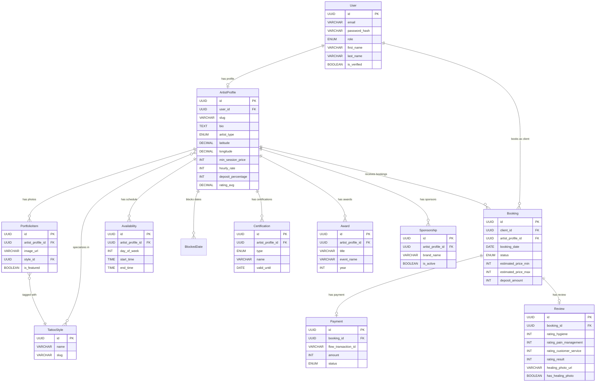

---

## 4. Diseño del Sistema a Alto Nivel

### 4.1 Arquitectura

INK·LINK adopta una arquitectura de **monolito modular** apropiada para la etapa pre-seed. Esto permite iterar rápido manteniendo separación lógica por dominio, sin la complejidad operacional de microservicios.

**Capas:**

1. **Capa de Presentación** — Angular SPA responsive que consume la API REST. Incluye el chatbot cotizador como componente embebido.
2. **Capa de API** — .NET Web API que expone endpoints RESTful con autenticación JWT.
3. **Capa de Dominio** — Servicios de negocio organizados por módulo: Artists, Bookings, Pricing, Reviews.
4. **Capa de Persistencia** — PostgreSQL como base de datos principal. Entity Framework Core como ORM.
5. **Integraciones Externas** — Flow (pagos), Object Storage (imágenes).

### 4.2 Decisiones Arquitectónicas

| Decisión | Justificación |
|---|---|
| Monolito modular | Etapa pre-seed, equipo pequeño, velocidad de iteración |
| API RESTful | Simple, bien soportada por Angular HttpClient |
| JWT para autenticación | Stateless, escalable, estándar de la industria |
| PostgreSQL | Soporte nativo para JSON, geoespacial (PostGIS), robustez |
| Object Storage externo | Imágenes de portafolio pesadas, no en DB |
| Flow como pasarela | Principal pasarela de pagos en Chile, WebPay alternativa |

### 4.3 Diagrama de Arquitectura

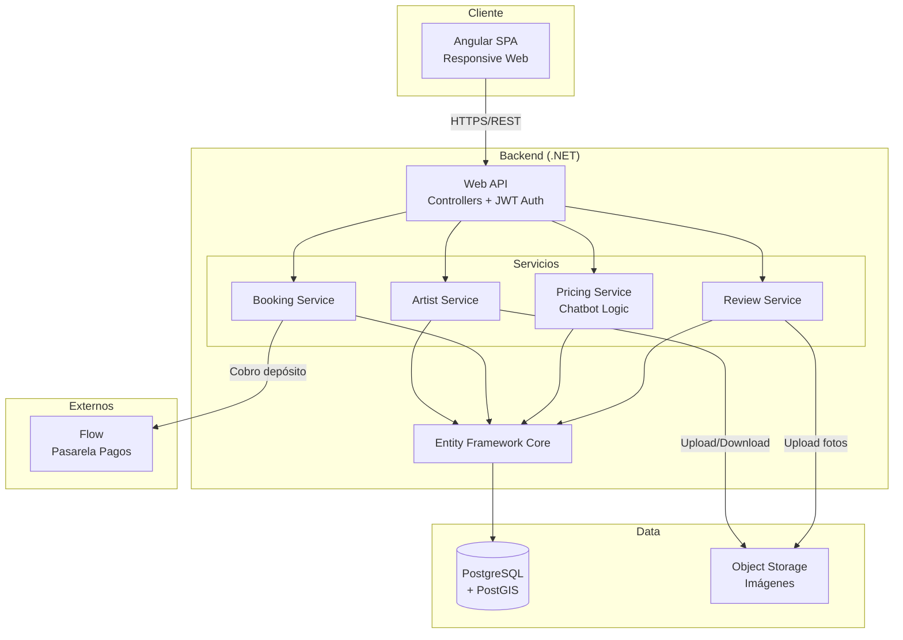

---

## 5. Diagrama C4

### 5.1 Nivel 1 — Contexto del Sistema

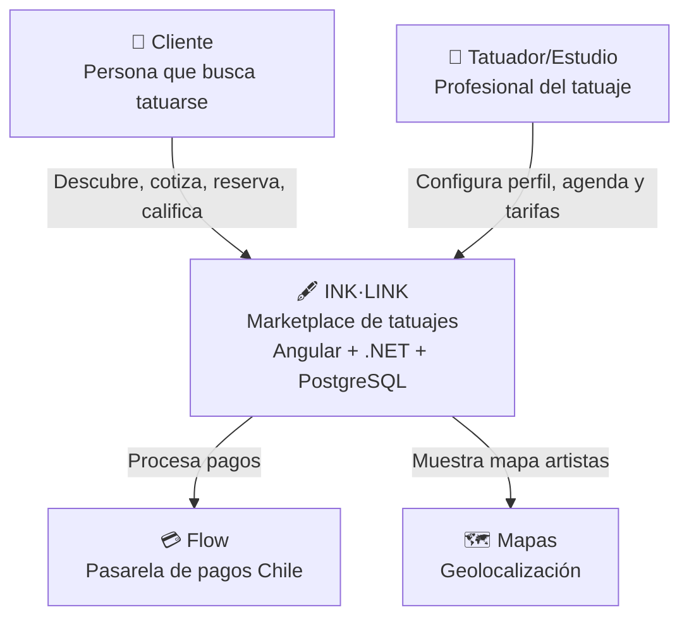

### 5.2 Nivel 2 — Contenedores

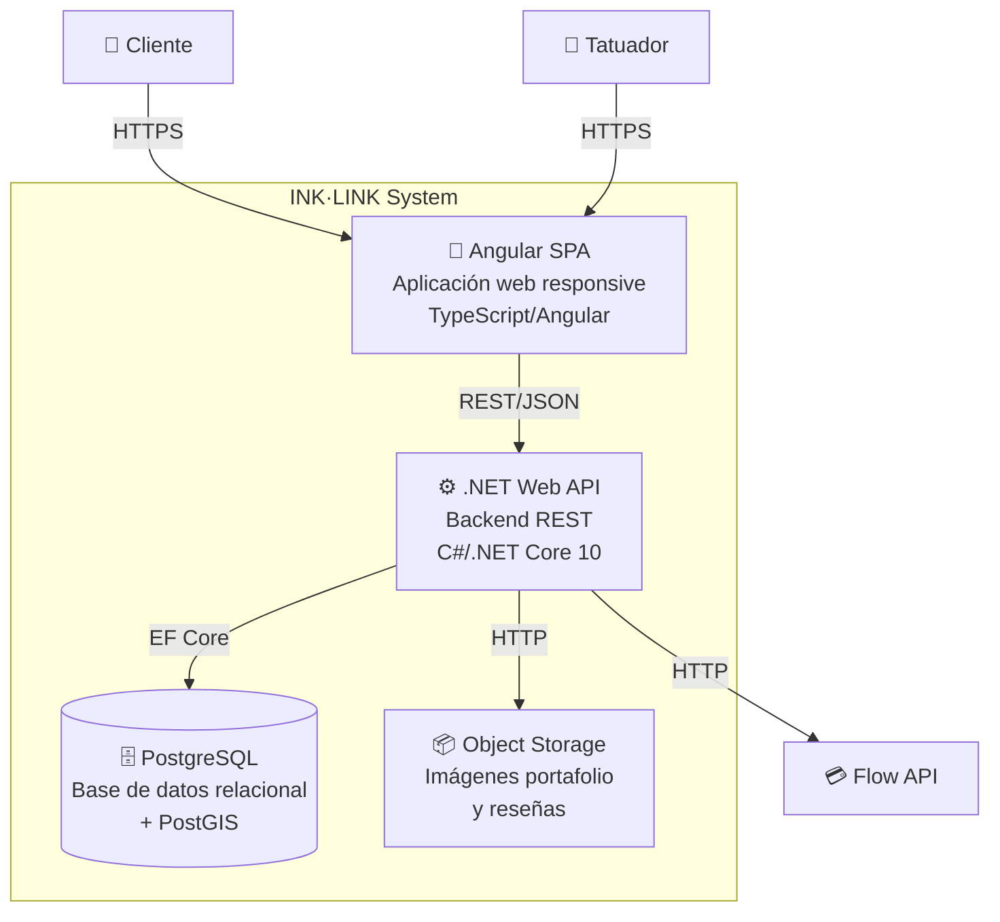

### 5.3 Nivel 3 — Componentes del Contenedor ".NET Web API"

Se profundiza en el contenedor **API Backend** por ser el componente central que orquesta toda la lógica de negocio.

> 📌 **Vigencia**: diagrama de diseño de la Entrega 1. Los controllers implementados difieren en nombre y granularidad (Auth, Showcase, Artists, Styles, Quotes, Availability, Bookings, Payments, Reviews, Geo — sin Register ni CRUD de artista, que es seed). El detalle as-built está en [ARCHITECTURE.md](../ARCHITECTURE.md) y el contrato en [api-spec.yml](api-spec.yml).

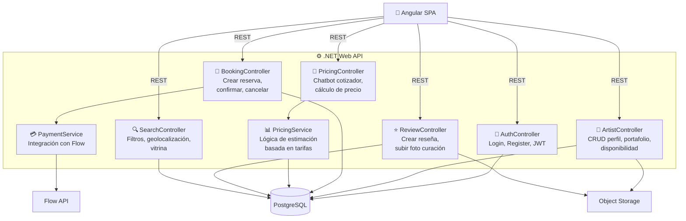

---

## Apéndice: Stack Tecnológico

| Capa | Tecnología |
|---|---|
| Frontend | Angular 20, TypeScript, Angular Material + SCSS |
| Backend | .NET Core 10, C#, ASP.NET Core Web API |
| Base de datos | PostgreSQL 16 + PostGIS |
| ORM | Entity Framework Core |
| Autenticación | JWT (Bearer tokens) |
| Pagos | Flow Chile API |
| Storage | S3-compatible (MinIO/AWS) |
| Mapas | Leaflet + OpenStreetMap |
